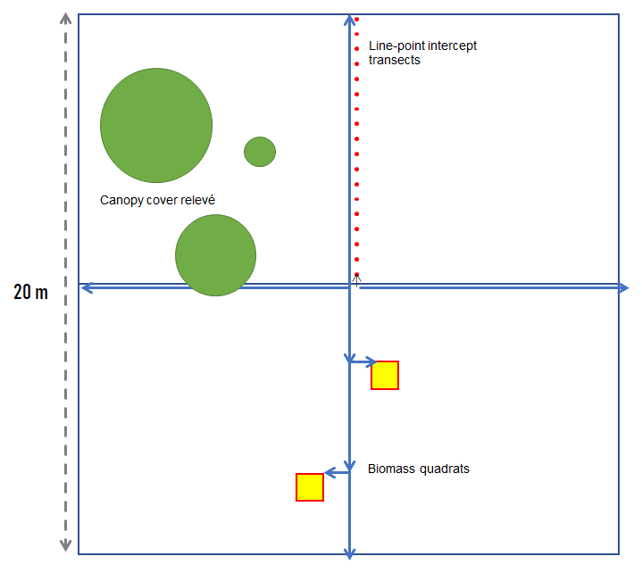

# Sampling intensity for all vegetation

## Principles:{-}
Our goal is to describe natural properties of vegetation. We choose protocols according to how efficiently or accurately they perform in measuring vegetation properties. Databases should be constructed around these natural properties, not around protocols.

Our descriptions are independent of aspirations of the land owner (land use) and regulatory status of vegetation. Though we may accommodate different users who need specific properties to be measured, we do not need to know how a given user would use the data in order for the minimum data set to be collected.

All vegetation will share a basic set of natural properties, while some other properties may be life form specific (e.g. stem diameter and basal area for trees). All vegetation has three classes of properties: species composition; an abundance measure; and a structure or height value. Abundance measures can be canopy cover, foliar cover, biomass, and frequency, but each is a different property which may entail different protocols to measure. USNVC considers canopy cover is the most universal form of abundance to record, while other forms of abundance are favored by specialized end users. 

Adjusting the intensity and speed of vegetation inventory should consider this order of priority. The order of importance is:

1. Species identity

1. Abundance

1. Structure

1. Life form and end user needs specific properties. 

## Tier 1

-	Species* (*genus for uncertain species) checklist accounting for at least 50% relative importance values (e.g. canopy cover).

-	Life form or growth habit is mostly a property tied to species identity, which caries an emergent property to the vegetation. However, it can be substituted for species in the most uninformed vegetation descriptions

### Additional option for biodiversity{-}

-	Comprehensive species* checklist with total importance values (e.g. canopy cover)

## Tier 2

-	Comprehensive species* checklist with canopy cover by stratum. Required strata are field, shrub, and tree according to USNVC definitions, but may be subdivided further to indicate overstory structure and recruitment.

### Additional option for trees{-}

-	Record basal area by species for dominant live trees > 10 cm wide and >5 m tall. May use estimate from variable radius plot.

## Tier 3

-	Comprehensive species* checklist with canopy cover by stratum. Required strata are field, shrub, and tree according to USNVC definitions, but may be subdivided further to indicate overstory structure and recruitment.

-	Record actual height of the top and bottom of the dominant foliage by species within each stratum, or at least the dominant stratum for each dominant species.

-	Record basal area and range in diameters (DBH) by species should be recorded for dominant live trees > 10 cm wide and >5 m tall. May use estimate from variable radius plot. May use estimate from variable radius plot. Can also opt to census all tree diameters fixed area plot, but summary diameter should be equivalent to quadradic mean diameter.

### Additional options for dead structure{-}

-	Basal area should include snags >10 cm wide and >2 m tall.

-	A ground surface cover transect should be used to assess down woody debris and leaf litter coverage (litter thickness?). Line-point intercepts (e.g. intervals of half a meter) can be done to estimate smaller woody debris and leaf litter, whereas a continuous line intercept may be more efficient for assaying larger woody debris (> 10 cm). The two methods need to be talleyed separately before the percentage cover totals are combined.

- Foliar cover from line-point intercept transect of vegetation less than 2 m tall.

### Additional options for carbon sequestration potential/productivity and grazing{-}

-	Biomass and/or annual biomass for productivity.

