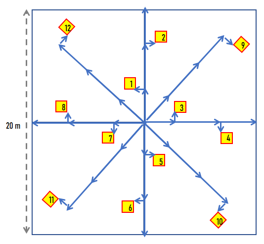

# Protocols

## Principles:{-}
Our goal is to describe the character of the vegetation; we should choose protocols according to how efficiently or accurately they capture basic vegetation attributes. In an ideal world, databases would be constructed around the natural hierarchy among these attributes, whereas data entry forms would be optimized around protocols. A protocol should be employed based on the observations and not be dependent on knowing land use (i.e. aspirations of the landowner) or regulatory status of vegetation. Land use history information, when available, can be used to provide context to the observation.

All vegetation shares a basic set of attributes. Some attributes that are life form specific can be recorded whenever those lifeforms are present and should not be omitted on the preconception of how the vegetation might be classified. All vegetation has three classes of attributes: composition; abundance; and structure. Composition is the taxonomic identity or form of the individual plants in the vegetation. Abundance measures the overall amounts of plants in terms of canopy cover, foliar cover, biomass, or frequency. Structure refers to the three-dimensional arrangement of plants, particularly related to distribution of plant height.

## Observation Intensity

Observation intensity prioritizes the attributes recorded with respect to the tradeoffs between sample size and time required for the inference being made.

### Scouting

Nonsystematic observations intended to develop hypotheses or to justify a return trip, not recorded as data.

*Optional Site Elements*

* 1.	Coordinates
  
  
*Optional Vegetation Elements*

* 1.	Ocularly estimated community label
  
### Low Intensity

Systematic observation with enough detail to diagnose community type, and record as point data, but not enough to fully characterize structure and composition. Low intensity observation include a collection of one or more data elements found in higher intensity observations. It is focused on dominant species (accounting for a cumulative 50% cover), total cover by lifeform, total species inventory by fixed plot area, line point intercept foliar cover transects, et cetera. These separate elements may inform community summaries of these attributes even if by themselves they are incomplete records of vegetation.

*Essential Site Elements*

* 1.	Site ID/Vegetation Plot ID
* 2.	Observer Name
* 3.	Date
* 4.	Coordinates (decimal degrees WGS84)
* 5.	Elevation (m)
* 6.	Slope (%)
* 7.	Aspect
* 8.	Geomorphic Component (e.g. Hillslope position) 
* 9.	Landform 
* 10.	Earth Cover Kind (Forest, Woodland, Grassland, etc.)
* 11.	Plot Area (typically 400 m²)
  
*Essential Vegetation Elements*

* 1.	Photo (recommend: 4 direction landscape, canopy wide angle,  ground)
* 2.	Total Overstory (>5 m) Canopy Cover 
* 3.	Total Vegetation (all vascular strata) Canopy Cover 
* 4.	Cover by _dominant_ species by stratum.
  * *Minimum regional standard:*
  * a. Most common species accounting for more than 50% of total relative cover
  * b. Considering at least 2 strata with 5 m threshold.

  
### Medium Intensity

Systematic observation with enough detail to characterize complete structure and composition. This is generally resolved as cover in two or more strata. All species are identified where possible.

**Essential Vegetation Elements**

* 1.	Cover by _all_ species by stratum
  * *Minimum regional standard:*
  * a. All taxa identified (cover for unknowns accounted for under a genus or functional group, ideally no more than 10% cover is from unknown)
  * b. Considering at least 3 strata with 0.5 m  and 5 m thresholds.
* 2.	Total Basal Area (variable radius plot, trees >= 10 cm in DBH)
* 3.	Basal Area by Species
* 4.	DBH (cm) by species (representative)

  
### High Intensity 

Systematic observation with enough detail to characterize complete structure and composition resolved in higher resolution, and with additional data elements. Resolution is generally as cover in three or more strata and live canopy height, with additional data elements such as basal area, diameter, age, biomass, down woody debris, snag density, etc. recorded as needed. All species are identified where possible.

*Essential Vegetation Elements*

*  1.	Maximum height by species (dominant)
*  2.	Total Basal Area (m²/ha)
*  3.	Basal Area by Species
*  4.	Total Snags per plot (>=10 cm DBH, > 2 m tall)
*  5.	DBH (cm) by species (all)
*  6.	Foliar cover by functional group
*  7.	Ground surface cover by cover type (e.g. down woody debris by size class, tree bases, bryophytes, lichens, leaf litter, bare ground)

## General Protocol

  1.	Delineate plot layout. The main plot is called a “macroplot” if subsampled with quadrats and transects. If limited in number of plots, position plot to be representative, avoiding stand boundaries unless heterogeneity is a recurring pattern that cannot be avoided by chosen plot size. While plot size could be adjusted to grain of reoccurring patterns (i.e. species area saturation curve), it is also useful to maintain a consistent scale for the species frequency metric (species richness area relationships). Plots can be square, rectangular, or circular. Although there is a general rule of thumb that the targeted size should  asymptotically account for most of the plant species in a stand, most plots tend to be 400 m². In difficult vegetation such as shrub thickets, or when conducting reconnaissance observations, plots can be a small as 100 m². Rich forests may not be adequately sampled at plot sizes under 0.1 ha (1000 m²).
  Other methods that go beyond a delineated plot (e.g. long transects or zigzag methods) can also be used if the goal is to characterize a whole stand or a community type. In this context the plot would represent just a sample unit of the whole. However, when the plot is paired and analyzed with a pedon record, the emphasis should be on the plot as an integrated unit representing a point on the landscape, and methods that stray from the point location should be avoided. An exception is made for variable radius plots where large trees are often counted outside the macroplot, but are often species that are represented in the understory or have large enough crowns to overlap the plot.
  2.	Estimate total canopy cover by stratum and lifeform. At minimum, there is an overstory and an understory at 5 m, and non-epiphytic herbaceous plants are tallied as part of the lowest stratum, the "field stratum" at <= 0.5 m (the rationale being that they die back to the lowest stratum each year). A plant must exceed the minimum height of the stratum, but not exceed the maximum height of the stratum. This data will be used to classify structure into basic vegetation type and to calibrate subsequent ocular estimates of plant species abundance.
  3.	Begin exhaustive species checklist within the boundaries of the plot. If a species is unknown, classify it to nearest, genus, family, or lifeform to ensure that gets accounted for in aggregated analyses. Preferably list species represented in the highest strata first (grouping species sharing strata facilitates data entry), but species discovery is an iterative opportunistic process making absolute control of order impossible. A variable radius plot can be conducted first to establish ordering priority.
  4.	If there are trees greater than 10 cm in diameter at a height of ~1.37 m (DBH), assess basal area. Measure diameters if needed.
  5.	Measure the heights of the tallest trees to calibrate subsequent stratum heights.
  6.	Assess the cover of each species in each stratum. Generally, start from the top stratum down, and remember to note whether the same species occurs in lower strata. Highest cover value cannot exceed the total aggregate cover for the stratum for which it is a member. Cover of species in the tree stratum can be proportioned according to their basal areas, though some species can be disproportionately more prolific in their crowns relative to their basal areas.
  If stratum height breaks are not specified, data analysis should assume the break points of 0.5 m and 5 m to represent a field, shrub, and tree stratum. However, flexibility in stratum height thresholds is allowable if a representative height is given for each stratum cohort of a taxon. The key is to have enough information on plant heights to integrate plot data with different stratum definitions. An additional tree stratum is recommended for tall forests at greater than 12 or 15 m. It is also common to insert a break at 2 m to separate low and tall shrubs. Increased precision in stratum breaks reduces the need for specifying representative heights within a stratum, though maximum height of each taxon should always be noted.
  7.	Consider seedling and sapling stem density. If species recruitment is important, define cohort by stem diameter or stratum, count number of individuals by species cohort in subplots.
  8.	If stand age or site index is important, core representative trees and count rings in addition to DBH and height.
  9.	If the density and richness of understory vegetation is high and it is difficult to get accurate ocular estimate of cover or if foliar cover is a needed metric, consider line point intercept transects (focused on vegetation < 2 m tall). For dense intermingling plants, the distinction between canopy cover and foliar cover is obscure. Ensure that any additional species found are recorded in the comprehensive macroplot species list. Use foliar cover values to recalibrate ocularly estimated cover if a large discrepancy exists, though transects usually do not capture every species in the macroplot. There needs to be a minimum of 100 points to detect foliar cover values less than 1%. 
  10.	If aboveground biomass or productivity data is needed (e.g. site managed for grazing), consider harvesting and weighing quadrats. Dry weights require that samples be saved and weighed after air drying. Depending on user need and time available and stand richness, weights are resolved to lifeform or species. Samples can also be stratified between direct measurement and estimated units.

