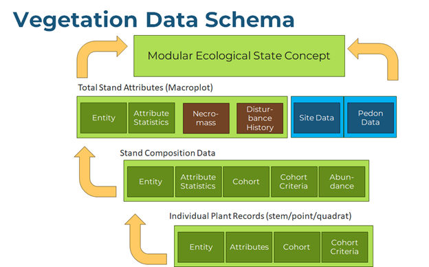

# Vegetation Databases
## Potential Data Schema for Vegetation Data

The purpose of a vegetation inventory is to characterize a general vegetation concept. For this, a logical vegetation schema is required. Vegetation data can be arranged hierarchically from sampling units dictated by a protocol (individual plant records), demographic summary of plant species cohorts occupying a unit of land (plot composition), and a whole structural summary of the plot, which in turn represent a larger inference area, stand, or vegetation classification concept.

Most vegetation types share the same set of measurable properties, but different priorities can be placed on properties depending on land use. A schema should be flexible enough to allow for degrees of uncertainty of the entities being populated. Through a combination of partial and complete records, a higher vegetation concept can be described. At minimum there should be enough data populated for the plot record to be classified to a higher concept. The attributes from each record can also be summarized to characterize that higher concept.

Each attribute from individual plant to generalized vegetation concept can be manifest at each level of abstraction. Attributes of individual plant record becomes statistical summaries of those same attributes when considering the whole plot. Not all protocols involve individual plant records, but instead may employ ocular estimates to estimate plot composition directly. Statistics are grouped by the entity name (taxon or habit) and usually partitioned into cohorts based on one or more of the measured properties (size/age classes). There are two different types of plant demographic statistics summarized. The first type is the summary of attributes among individuals in a cohort, and the second type is a summary quantifying the attribute relative to a land area. For example, mean height is meaningful only as a summary per individuals. Mean crown width and quadratic mean diameter may also be  meaningful on a per individual basis, but these same properties are manifest as plant abundance in terms of percent canopy cover and basal area (stem area per land area), respectively.

At the highest level of abstraction (structure), named entities are dissolved, cohorts may be concatenated into fewer groups, and the summaries are more generalized structural summaries can sometimes be calculated as aggregated attributes from the composition tables, but some attributes can only be estimated independently of the composition data (e.g. total canopy closure, total canopy gap). At the plot level, rather than species name or habit, the named entity reflects a summary of the overall dominant composition (association name) or structure (structural label such as “forest”, “shrubland”, or “grassland”)

For the sake of data analysis, all possible statistics that summarize species composition should be available in the same table, even if variations exist in the protocols used to get these statistics. Where different protocols or sampling areas are used to account for these statistics in the same site, it is better practice to establish independent plot records specifying the differences than to maintain redundant tables.

Ultimately all the attributes in point data summarize the essential attributes of the modular ecological state concept. A modular ecological state could be moved, split, or merged with other such concepts and its underlying attributes would recalculate. There should be no concern for renumbering or disrupting a nested structure of the state-and-transition model. Any causal relationship posed by the end user between any two modular ecological state box would be inferred dynamically (or at least a filter a list of possible agents of change) from the contrast among their corresponding attributes.

*1)	Individual Plant Records (stem/point/quadrat)*

  * a)	Entity (categorical data)
    * i)	Species
    * ii)	Higher Taxon
    * iii)	Habit/Growth Form/Plant Type/Functional Group
  * b)	Single Plant Attributes (numeric data)
    * i)	Plant Height
    * ii)	Plant Stem Diameter
    * iii)	Plant Crown Width
    * iv)	Foliar Hit or Plant Total Leaf Area
    * v)	Quadrat Biomass or Plant Total Biomass
    * vi)	Plant Age
    * vii)	Plant Growth Rate
  * c)	Cohort Membership (categorical data - demographic partition of entity)
    * i)	Cohort Label
  * d)	Cohort Criteria (numeric data - grouping based on an attribute)
    * i)	Height Class
    * ii)	Diameter Class
    * ii)	Age Class
    
*2)	Stand Composition Data Table*

  * a)	Entity
    * i)	Species
    * ii)	Higher Taxon
    * iii)	Habit/Growth Form/Plant Type/Functional Group
  * b)	Attributes (Summarized)
    * i)	Plant Height Statistics
    * ii)	Stem Diameter Statistics 
    * iii)	Crown Width Statistics
    * iv)	Age Statistics
  * c)	Cohort Membership
    * i)	Cohort Label
  * d)	Cohort Criteria
    * i)	Height Class
    * ii)	Diameter Class
    * iii)	Age Class
  * e)	Abundance (attributes per unit area)
    * i)	Frequency
    * ii)	Stem Density
    * iii)	Stem Basal Area
    * iv)	Canopy Cover
    * v)	Foliar Cover
    * vi)	Biomass
    * vii)	Productivity

*3)	Total Stand Attributes Table*

  * a)	 Entity
    * i)	Community Name (association/common name)
    * ii)	Community Structure Label
    * iii)	Community Dominant Species (short list)
  * b)	Aggregate Attributes (derived from stand composition data)
    * i)	Stand Species Richness
    * ii)	Stand Height Statistics
    * iii)	Stand Diameter Statistics
    * iv)	Stand Total Basal Area
    * v)	Stand Canopy Closure
    * vi)	Stand Total Tree Canopy Cover
    * vii)	Stand Total Shrub Canopy Cover
    * viii)	Stand Total Herb Canopy Cover
    * ix)	Stand Total Nonvascular Cover
    * x)	Stand Total Vegetation Canopy Cover (Inverse Canopy Gap)
    * xi)	Stand Leaf Area Index (total foliar cover of all strata)
    * xii)	Stand Total Stand Biomass (aboveground/belowground)
    * xiii)	Stand Productivity
    * xiv)	Stand Age
  * c)	Necromass Attributes (independent of stand composition data)
    * i)	Snag Density (size class/decay class)
    * ii)	Down Woody Debris Statistics (size class/decay class)
    * iii)	Leaf Litter Cover
  * d)	Plot metadata
    * i)	Protocol
    * ii)	Plot size
    * iii)	Transect length (number of points)
    * iv)	Inventory intensity class (but specifications should speak for themselves)
    * v)	Taxonomic completeness

    

## VegLog MS Access Database

Relevé plot data is collected in a way that optimizes efficiency and quality control in the field, but is not suitable for [NASIS (National Soil Information System)](https://www.nrcs.usda.gov/resources/guides-and-instructions/nasis-user-guides) in its current form.  Field collection datasheet allows cover data for up to 4 strata to be recorded in a single row, ensuring that an observed plant taxon need only be listed once per plot. This avoids the need to recursively scan for the same taxon multiple times to ensure that the occupancy of each stratum is recorded appropriately. However, NASIS records each taxon-stratum incidence as independent rows. Additionally, Relevé protocol [@dnr2013handbook] is based on [SI (International System of Units)](https://www.nist.gov/programs-projects/international-system-units-si) as are all soil pedon description protocols, but NASIS currently only allows for legacy protocols based on [USC (US customary)](https://www.nist.gov/pml/owm/approximate-conversions-metric-us-customary-measures) units to be entered. Prior to entering data into NASIS (National Soil Information System), it is recommended that it first be entered into the custom MS Access Database **VegLog**.

- Select user name.

### Site data {-}

- Enter GSP coordinates in decimal degrees of each plot location. If need be, enter degrees, minutes, seconds at the bottom to auto calculate decimal degrees in current record.

### Taxon data {-}

- Enter species list. Use genus and specific epithet autolookup fields.

- Enter all the cover values of each of 4 strata. The default heights are 0-0.5, 0.5-5, 5-15, and 15+ meters, but this can be adjusted.

- Enter basal area of taxon based on variable radius plot as determined by prism or angle gauge. May need to adjust BAF (basal area factor) if not USC BAF base 10. SI BAF 2 is also supported.

- Enter the maximum and minimum of observed live crown height of dominant (highest) stratum of the taxon in meters. After entering all the data for the plot, use the button to auto populate these heights to their appropriate height within stratum. Live crown heights can also be manually specified for the lower strata in the additional columns, but paper forms may not have the extra columns, and it is relatively redundant information (presence in highest stratum demonstrates capability of taxon to occupy full height range any lower stratum also present).

- Enter the maximum and minimum diameters (DBH - diameter at breast height) in centimeters of trees observed to fall within the basal area plot (variable radius plot).

### Other Vegetation details and processing {-}

- Enter total cover for each stratum (if zero, leave blank).

- **Synonymize Plant Taxa** (assigns PLANTS symbols).

- **Aggregate Cover** to show current estimate of aggregate cover, then **Transform Overstory** and **Transform Understory** to adjust individual cover values to be more consistent with observed whole stratum cover.

### Reports (conversions to NASIS) {-}

- **Paste to NASIS** to convert to USC units and serialize taxon by stratum data.

## Vegetation Plot Object in NASIS

Tips: Row entries save in the local database when you advance to the next record. But if in last new row, the record needs to be saved manually with the end edit green check button at bottom of screen, prior to saving all records (upload) to the national database. After saving to the national database, remember to check in the records to unlock them for future edits. You may rearrange the columns by dragging them to reflect the datasheet that you are copying from.

-	Create new record in **Vegetation Plot** table.

-	Assign plot record to the appropriate user **Site ID** and **observation date**, or create new observation if different from pedon observation date.

-	Name user **user vegplot id** the same as site id, but may append suffix of P to indicate plot, or T to indicate transect, given that the observation dates can differ and require different observation records.

-	There are two ways to enter the species composition records: 1. By column (faster); by row.

-	Enter species as it appears on your datasheet. You may either enter the full Latin name or enter the [PLANTS](https://plants.usda.gov/) symbol if you’ve conducted a lookup query in the source database where data was initially entered.

    -	If entering by column, proceed with entering each name, vertically before entering the data for other columns, using the down arrow to advance to the next new record. The same species may be entered multiple times. Take care that the sort order of the rows remains consistent with the order on your datasheet to ensure that data entered by column remains correlated properly (not a problem if completing each column of each new row horizontally). You may sort by any of the columns by pressing on the column name; to restore original order of entry, sort by Rec ID on the far right.

-	Select the appropriate growth habit in the **Plant Type Group**. Every species should have a default value established that is the same regardless of the stature in existing plot record; see regional ecologist if you need a list of accepted values. For by column entry, most entries require only first one or two letters of the growth form, followed by enter, then arrow down.

-	Select the appropriate Plant Nativity, based on whether a taxon is considered native to the state where the inventory was recorded. See [BONAP](http://bonap.net/tdc) to determine the nativity status. Some species are native to North America, but are considered “adventive” to a state on the BONAP website; select “introduced” in these instances. Select “unknown” for species with both native and introduced genotypes (e.g. _Phalaris arundinacea_).

-	Enter all the Species **Canopy Cover Percent** to the nearest whole percent. If rounding down to zero, you need to select the **Spp Trace Amount Flag** checkbox. Advance to each record using the down arrow. For greater precision to the neared 0.1%, use **akstratumcoverclasspct**. If you recorded using the cover classes, **speciescancovclass** is also acceptable. All these cover options will be converted to strictly numeric data when analyzed later.

-	For each species stratum entry, there is a **Height Class Lower Limit** and **Height Class Upper Limit**. These are typically based on federal government vegetation standards [@usnvc2008] lower stratum heights converted from meters to feet: 0 to 1.6; 1.6 to 16.4; 16.4 to user define limits for upper strata (e.g. 16.4 to 49.2 and 49.2 to 98.4). To ensure data integrity of original SI units, do not round to the nearest whole number.

-	Enter Live **Canopy Ht Bottom** and **Live Canopy Ht Top** the height range of the typical crowns for current taxon within current stratum. The top height is generally going to be within the upper and lower range for the stratum. The canopy bottom can range below the range of the stratum, because the stratum only reflects the top heights of plants in that stratum, while the lowest live branches can extend below that height. Often this is only recorded for the uppermost stratum of the taxon, as it can be safely assumed that the live canopy of lower strata can encompass the whole range of the stratum over time. Enter as feet, but to ensure data integrity if recorded in the field as SI units, do not round to the nearest whole number.

-	Enter **Overstory DBH Minimum** and **Overstory DBH Maximum** as inches converted from centimeters. To ensure data integrity of original recorded SI units, do not round to the nearest whole number. Typically, this is only recorded for trees in the uppermost stratum for the taxon.

-	Enter **Basal Area by Spp**. This is typically based on tree count with a prism, multiplied by a factor. If using a USC factor ten prism, the count is multiplied by ten and entered as is. If using an SI factor two prism, you must convert it to USC; this is less common due to a shortage of SI equipment domestically. To ensure data integrity if originally recorded using SI units, do not round to the nearest whole number.

-	Other remaining columns are optional **Vegetation Strata Level** only recognizes overstory and understory. If using this column, the overstory strata are those more than 5 m or 16.4 ft. **Spp DBH Average** is really the quadratic mean diameter if you use a prism to select trees to measure. You can enter each tree diameter individually, but this would need to go into the **Plot Tree Inventory** table.
