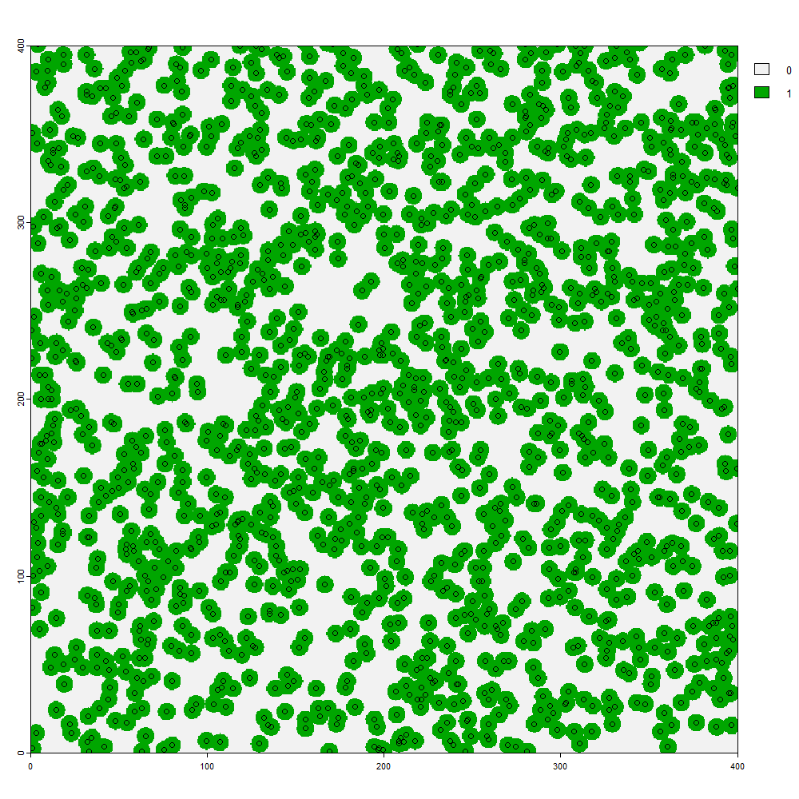
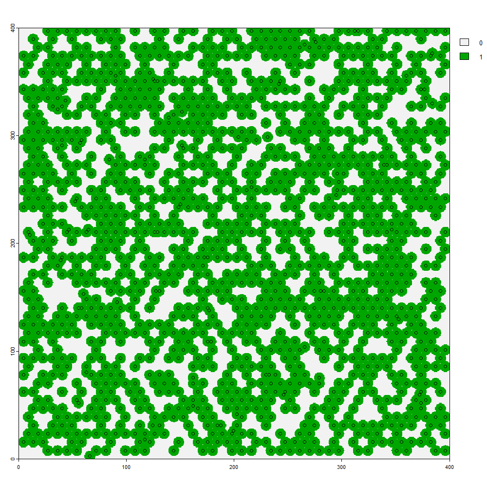

# Vegetation Analysis

## Plot Data Schema

Several vegnasis functions require data frames with a predefined standard set of column names to operate. 

The **pre.fill.veg()** was designed to allow the user to process any data frame by filter out extraneous data columns and append any missing columns. Prior to using this function, steps are initially taken to manually assign existing data to a standardized column names as much as possible. User has a responsibility to convert any legacy units of measure to SI (metric system) for subsequent analyses to be scaled properly. Conversions to USC units, if desired, should take place only as a final step after analysis.

The **clean.veg()** function can read the column names as they exist in NASIS and make the appropriate assignments and unit conversions. 


**plot** = Unique identifer for plot.

**label** = Convenient contextual name for plot.

**symbol** = USDA PLANTS symbol.

**taxon** = Species (binomial), and sometimes genus, subspecies, or varieties.

**type** = Growth habit or form such as 'tree', 'shrub/vine', 'grass/grasslike', 'forb', 'moss', etc.

**nativity** = 'native' or 'introduced' status within the geographic area or the plot.

**cover** = crown or canopy cover (not the same as foliar cover).

**stratum.min** = minimum height range (m) of stratum considered to be occupied by this taxon.

**stratum.max** = maximum height range (m) of stratum considered to be occupied by this taxon.

**crown.min** = bottom height (m) of live canopy for members of this taxon occupying this stratum.

**crown.max** = top height (m) of live canopy for members of this taxon occupying this stratum.

**diam.min** = mimimum diameter (cm) of trees measured (usually at "breast height", 1.37 or 1.4 m above the grown, a.k.a. 'DBH').

**diam.max** = maximum diameter (cm) of trees measured (usually at "breast height", 1.37 or 1.4 m above the grown, a.k.a. 'DBH').

**diam*** = mean diameter (cm) of trees measured using a variable radius plot (BA prism) or quadratic mean diameter of all trees within a fixed plot. Defaults to a mean of the maximum and minimum diameter if not all trees were measured.

**BA** = basal area (square meters per hectare).

```{r warning=FALSE, message = FALSE}

library(vegnasis)
obsite <- c('plot1','plot1','plot1', 'plot2', 'plot2')
 obsspp <- c('Acer rubrum','Pinus strobus','Pteridium aquilinum', 'Lindera benzoin', 'Trillium grandiflorum')
 abund <- c(80,10,30,10,10)
 mydata <- data.frame(obsite=obsite, obsspp=obsspp, abund=abund)

 #Identify columns containing data corresponding to standard column names.
 mydata <- mydata |> mutate(taxon=obsspp, cover=abund, plot=obsite)
 veg <- mydata |> pre.fill.veg()

 knitr::kable(
  head(veg, 10), booktabs = TRUE,
  caption = 'A table of rudimentary veg data.'
)
```

## Aggregating Cover


Appendix K in the USNVC (@usnvc2008) presents a formula intended to combine cover values of multiple strata without exceeding 100%. 

$$C_i = (1 - \prod_{j=1}^n(1-\frac{cover_j}{100}))*100$$
This is useful for many operations when combining strata or aggregating structure within a stratum. When assessing total canopy cover for a stand, individual cover values may sum greater than 100%, yet an independent assessment of cover doesn't exceed 100%. Conversely, amount of open sky (not filtered by a crown outline) cannot be negative. More simply stated as a formula that can be plugged into RStudio:
````{r}

cover = c(10, 20)
100*(1-10^(sum(log10(1-(cover/100)))))

cover = c(5, 10, 20, 30, 40)
100*(1-10^(sum(log10(1-(cover/100)))))
```

Whereas a simple sum is similar to the formula when adding two small values and exceeds 100% with adding more or higher values:
````{r}
cover = c(10, 20)
sum(cover)

cover = c(5, 10, 20, 30, 40)
sum(cover)
```

The formula allows for random crown overlap, which is minimal at low density, but increases with density as total aggregated cover approaches 100%. As such, the function **vegnasis::cover.agg.stratum()** is used within many different functions that combine species or stratum cover. 

But in reality, crowns in the same stratum avoid each other, and cover in the understory tends to correlate with gaps (avoiding shade).

The effect of crown overlap versus competition is illustrated when considering a stand of trees and treating each tree as an independent species. For and area of 16 ha (400 by 400 m), 1500 trees with crown diameters of 10 m have a potential to cover 73.6% of the area. If planted at random and allowed to overlap, about 52.1% of the area is predicted by the formula, close to a simulated value of 52.0%. 




However, if an equidistant hexagonal grid is established which gives priority to planting trees further apart, the total cover does not aggree with the formula.


Trees semi-randomly planted at 1500 per 16 ha (and crowns of 10 m in diameter), simulating crown competition, cover 66.2% of the area, intermediate between the formula's predicted 52.1% and the maximum potential area of 73.6%.



For most natural settings, when the only a few cover values are to be aggregated and for which there is a big difference in cover, the default formula by **vegnasis::cover.agg.stratum()** is adequate. But other applications where the need is to predict the total cover of multiple individuals competing in the same stratum, an alternative formulation by **vegnasis::cover.agg.stratum()** is given which averages the expected sum (maximum capped at 100%) and the default formula.


