# Navigating NASIS

## NASIS Data Entry

Efficient vegetation data entry into the National Soil Information System (NASIS) is often a combination of direct entry into NASIS tables and the use of different customized NASIS forms. The following instructions are just one possible scenario that I have found works for me.

1.	Establish Site record directly in site table the User Site ID and GPS coordinates.
2.	Establish date within Site Observation child table.
 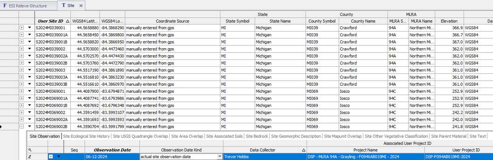
 
Establish VegPlot record directly in Vegetation Plot table, entering User Plot ID and select the appropriate Site Observation (seen as User Site ID and Date). Enter any other values that might be common among the plots.

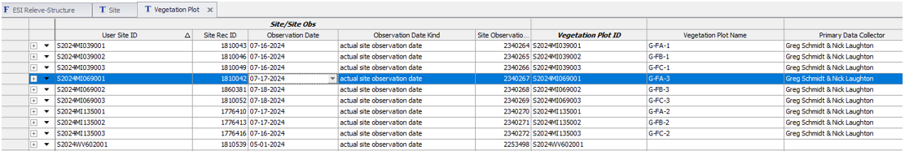

 
Open Plot Plant Inventory child table and establish the species list. Rather than scrolling to find all the required columns, proceed to one of the following forms. 

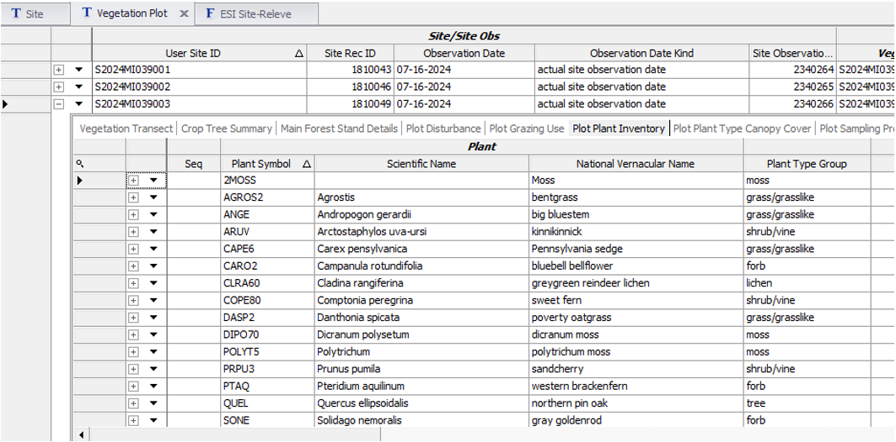

Open ESI Site-Releve form and populate the site and plot meta data. This form requires that both Site and Vegetation Plot records be checked out and editable. If the Site table is already populated, there is no need to check out the record. 

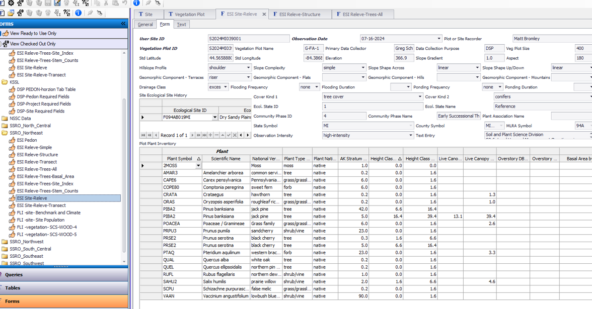
 
Instead, use one of the simpler forms that only accesses data from Vegetation Plot. 
Use ESI Releve for simple species cover by stratum.

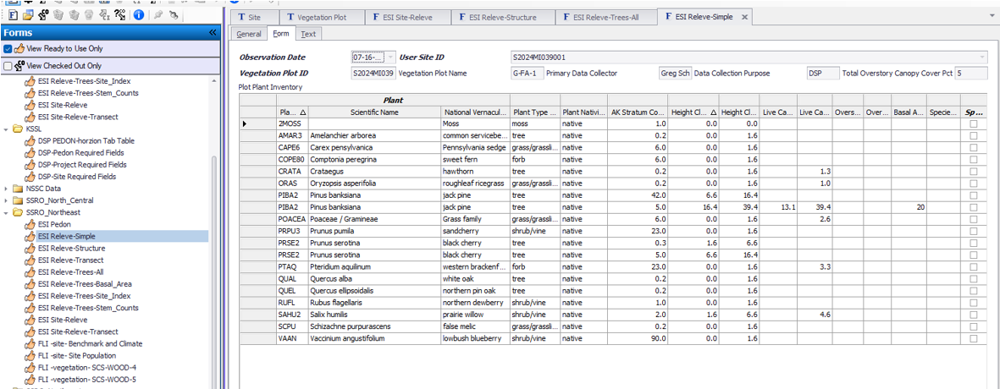
 
Use ESI Releve Structure to fill out plot details other than species composition.

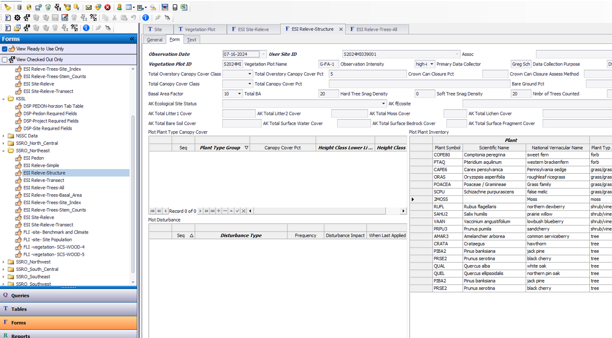
 
Use ESI Releve-Trees-All to enter basal area tree diameters and site index.

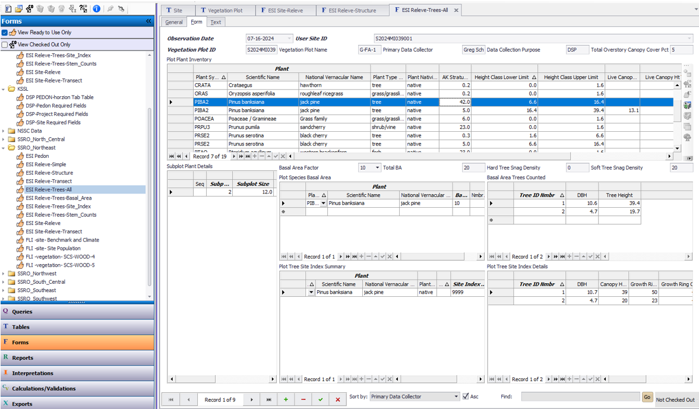
 
Use ESI Releve-Transect

 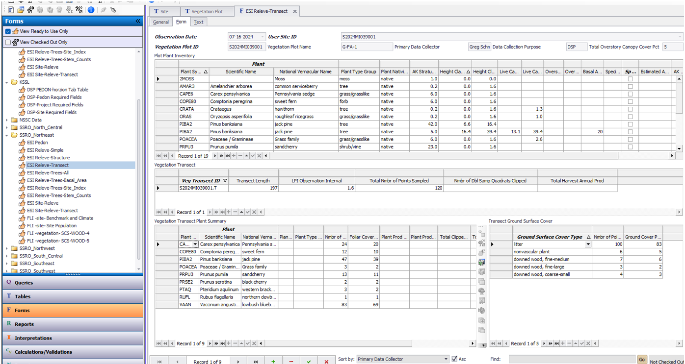

Optionally, create a record for Site Association and name it the same as the relevant NASIS Project. Populate the Site child table with all the sites observed for the project. If this is an Ecological Site Verification project, you may opt to include sites observed for  previous projects if they have plot data relevant for integration with the current project.
 

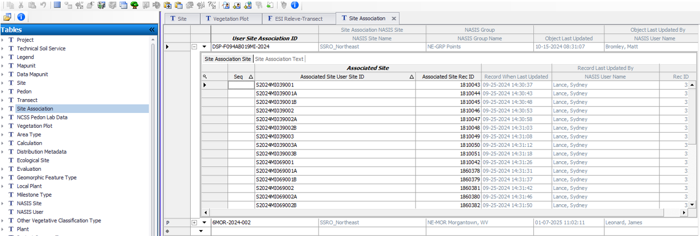

### NASIS Data Extraction

NASIS is not a user friendly database in getting data back out with simple cut and paste as one might do in a spreadsheet or MS Access database. Here we use R and RStudio as a scripting environment which will allow you to call upon the data stored in NASIS and export it as a simple comma delimited spreadsheet file (*.csv). The goal is often to summarize multiple plot data into to represent a community type in the Ecosystem Dynamics Interpretive Tool (EDIT). The following workflow will require that you've created a NASIS site association to link your related vegetation plots, and that you have properly named the community phases in your NASIS site observations records related to each vegetation plot.

1.	Query for Ecological Site Verification Projects in your Region and load them into your local database.
 
 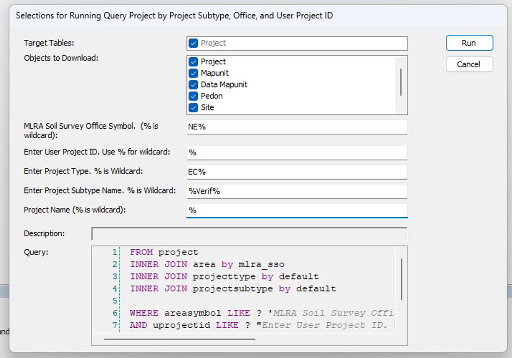

2. Get list of project user ids in R by running this script.
```{r warning=FALSE, message = FALSE, eval=FALSE}
library(soilDB)
projects <- soilDB::get_projectmapunit_from_NASIS(SS=F)
projects <- subset(projects, select=c(projectiid, uprojectid, projectname)) |> unique()
paste(projects$uprojectid, collapse = " ")
```
Just copy the set of project IDs in the RStudio console without the quotes.
 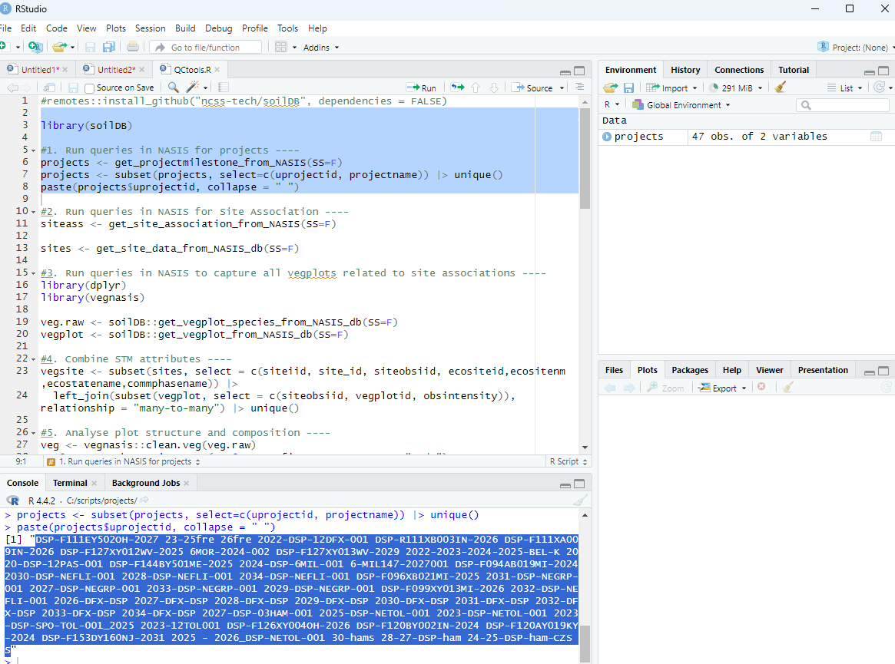


3.	Run this query in 3-4 stages to get data from all related tables. Query for sites and site associations using *SiteObs by list of Site Associations*, run nationally.

  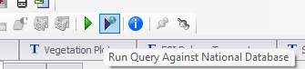
  
  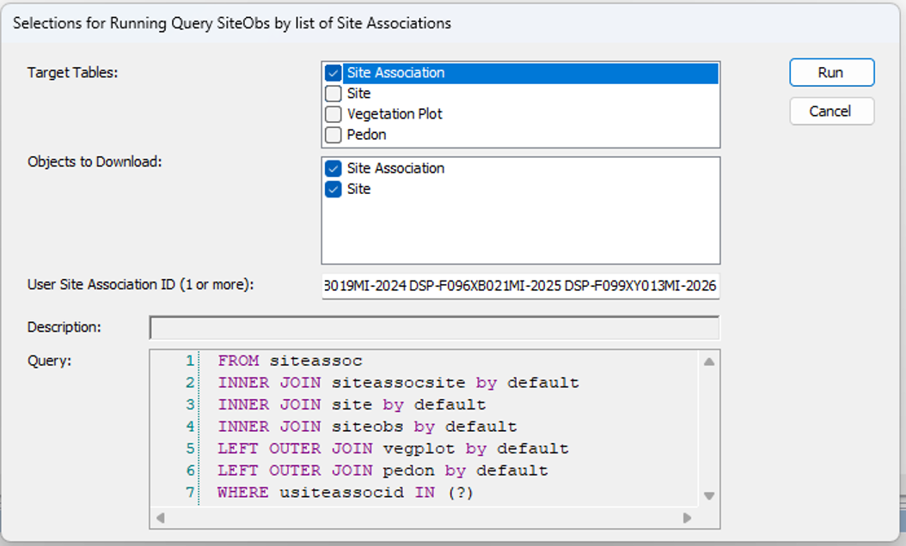

4.	Get the vegplots, run nationally.

  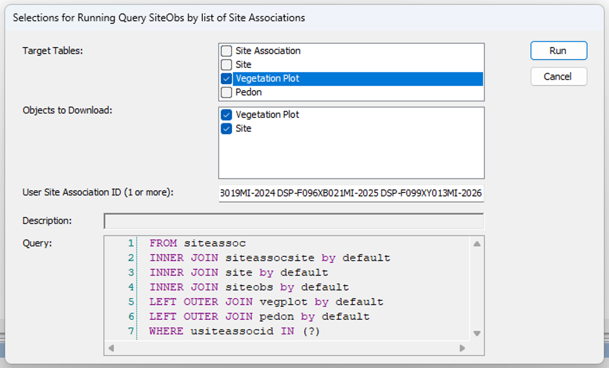
 
5.	Get the pedons if needed, run nationally.

  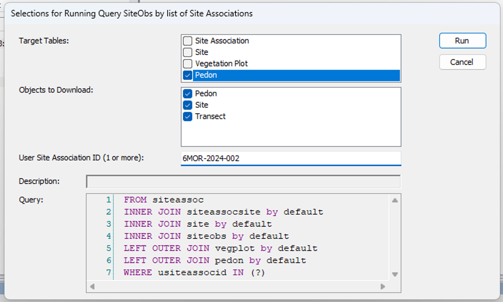
 
6.	Run local query for all objects.

  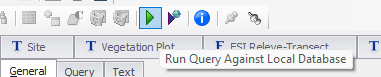
  
  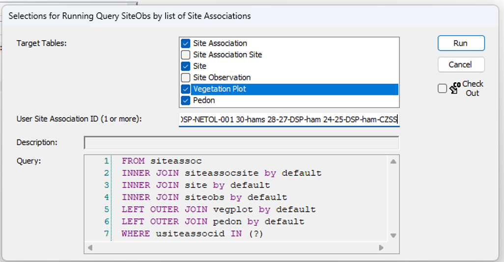
  
```{r warning=FALSE, message = FALSE, eval=FALSE}
#Site data  
siteass <- get_site_association_from_NASIS(SS=F)
sites <- get_site_data_from_NASIS_db(SS=F)
#Vegetation data
veg.raw <- soilDB::get_vegplot_species_from_NASIS_db(SS=F)
vegplot <- soilDB::get_vegplot_from_NASIS_db(SS=F)
```

Data are now available in R environment for quality control and analysis.

## Getting data into EDIT

```{r warning=FALSE, message = FALSE, eval=FALSE}
#remotes::install_github("ncss-tech/soilDB", dependencies = FALSE)

library(soilDB)

#1. Run queries in NASIS for projects ----
projects <- get_projectmilestone_from_NASIS(SS=F)
projects <- subset(projects, select=c(uprojectid, projectname)) |> unique()
paste(projects$uprojectid, collapse = " ")

#2. Run queries in NASIS for Site Association ----
siteass <- get_site_association_from_NASIS(SS=F)

sites <- get_site_data_from_NASIS_db(SS=F)

#3. Run queries in NASIS to capture all vegplots related to site associations ----
library(dplyr)
library(vegnasis)

veg.raw <- soilDB::get_vegplot_species_from_NASIS_db(SS=F)
vegplot <- soilDB::get_vegplot_from_NASIS_db(SS=F)

#4. Combine STM attributes ----
vegsite <- subset(sites, select = c(siteiid, site_id, siteobsiid, ecositeid,ecositenm,ecostatename,commphasename)) |>
  left_join(subset(vegplot, select = c(siteobsiid, vegplotid, obsintensity)), relationship = "many-to-many") |> unique()

#5. Analyse plot structure and composition ----
veg <- vegnasis::clean.veg(veg.raw)
veg$taxon <- harmonize.taxa(veg$taxon, fix = TRUE, sensu = "usda")
veg <-  veg |> fill.type.df() |> fill.hts.df()

veg.structure <- get.structure(veg)
veg.ass <- get.assoc(veg)

veg.over <- veg |> subset(ht.max > 5) |> group_by(plot, taxon, type) |> summarise(cover=cover.agg(cover))
veg.under <- veg |> subset(ht.max <= 5) |> group_by(plot, taxon, type) |> summarise(cover=cover.agg(cover))


#5. Summary Plant Composition Table for export as spreadsheet for pasting into EDIT ----
Veg.group <- veg |> left_join(vegsite, by=join_by(plot==vegplotid),relationship = "many-to-many") |> subset(!is.na(plot)) |>
  #Create a group
  mutate(group = paste(ecositeid, ecositenm, ecostatename, commphasename))

EDITsum <- vegnasis::summary.ESIS(Veg.group, group = 'group',normalize = TRUE, lowerQ = 0, upperQ = 1, breaks = c(0.5,5,12), forEDIT = TRUE) |>
  #Round up for high cover
  mutate(cover.High=ifelse(cover.High < 0.1,0.1,cover.High)) |>
  #Override plant type
  mutate(type = case_when(symbol %in% 'COCAC3' ~ 'Forb/Herb',
                          symbol %in% 'CASP14' ~ 'Forb/Herb',
                          symbol %in% 'PRSU3' ~ 'Shrub/Subshrub',
                          symbol %in% '2LICHN' ~ 'Biological Crusts',
                          symbol %in% 'Orchidaceae' ~ 'Forb/Herb',
                          TRUE ~ type),
         #Set sort order based on type
         type.top = case_when(type %in% 'Tree' ~ 1,
                              type %in% 'Shrub/Subshrub' ~ 2,
                              type %in% 'Vine/Liana' ~ 3,
                              type %in% 'Grass/grass-like (Graminoids)' ~ 4,
                              type %in% 'Forb/Herb' ~ 5,
                              type %in% 'Fern/fern ally' ~ 6,
                              type %in% 'Nonvascular' ~ 7,
                              type %in% 'Biological Crusts' ~ 8,
                              TRUE ~ 9)) |> arrange(group,overstory,type.top, desc(taxon.cover), taxon)

#Unit conversion is optional because EDIT allows either SI or USC data entry.
EDITsum.USC <- EDITsum |> mutate(Bottom = ht.USC(Bottom), Top = ht.USC(Top), dbh.Low=dbh.USC(dbh.Low), dbh.High=dbh.USC(dbh.High), BA.Low=BA.to.USC(BA.Low), BA.High=BA.to.USC(BA.High))
write.csv(EDITsum, 'EDITsum.csv', row.names = FALSE, na = "")

#6. EDIT Stand Structure ----

veg.str <- summary.crown.thickness(veg, breaks = c(0.15,0.3,0.6,1.4,4,12,24,37)) |> structure.fill.zero() |> subset(type %in% c('tree', 'shrub/vine', 'grass/grasslike',  'forb'))

veg.str <- veg.str |> left_join(vegsite, by=join_by(plot==vegplotid),relationship = "many-to-many") |> subset(!is.na(plot)) |>
  #Create a group
  mutate(group = paste(ecositeid, ecositenm, ecostatename, commphasename))


veg.str.pct <- veg.str |> group_by(group, type, stratum, stratum.label, bottom, top) |>
  summarise(X25 = quantile(Cover, 0.25),
            X50 = quantile(Cover, 0.5),
            X75 = quantile(Cover, 0.75))

write.csv(veg.str.pct, 'veg.str.pct.csv', row.names = FALSE, na = "")
```

Find your comma delimited spreadsheet, 'EDITsum.csv', open and then copy and paste the relevant portions into EDIT. Be cognizant of whether EDIT is set on SI (metric) units or USC (US Customary or English) units. Vegnasis package analyses data in SI units, but you can optionally convert all data to USC prior to exporting it as a spreadsheet. Or you can set EDIT to accept SI units.

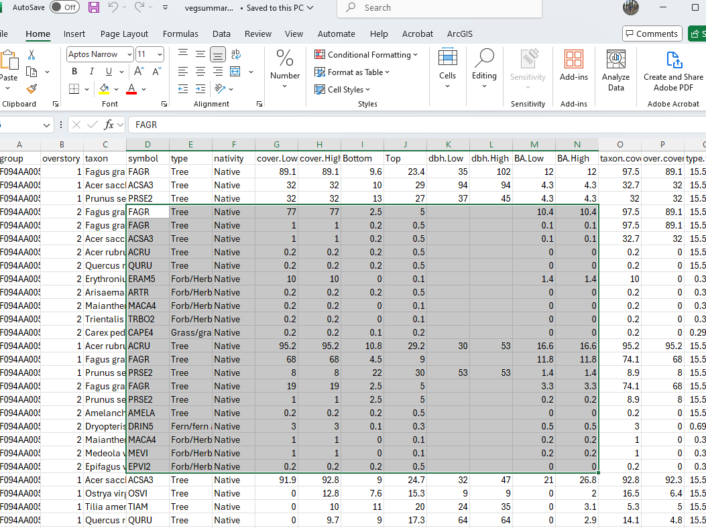
  
    
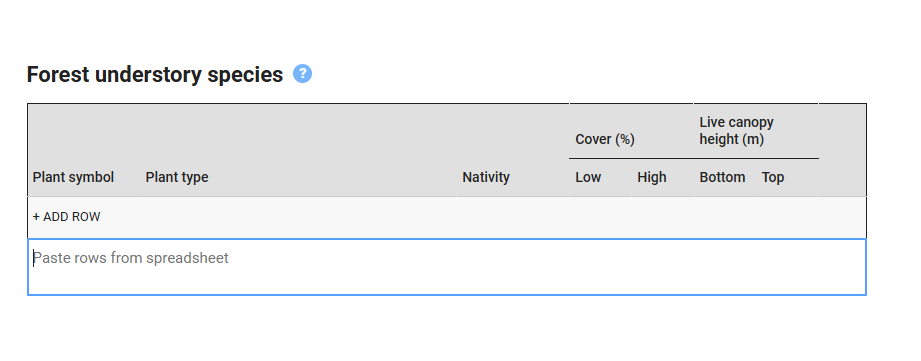

