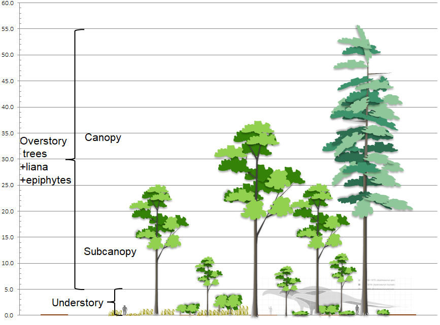

--- 
title: "Essentials of Vegetation Data"
author: "Greg J. Schmidt"
date: "`r Sys.Date()`"
site: bookdown::bookdown_site
documentclass: book
bibliography: [book.bib, packages.bib]
biblio-style: apalike
url: https://phytoclast.github.io/vegbook
# cover-image: path to the social sharing image like images/cover.jpg
description: |
  This is a brief instruction manual of how to inventory vegetation, and how to process and analyse vegetation data.
link-citations: yes
github-repo: phytoclast/vegbook
---

This is a brief instruction manual of how to inventory vegetation, and how to process and analyse vegetation data. 

# What is Vegetation?

There are two main attributes of vegetation: **structure** and **composition**. **Structure** is the physical manifestation of the plant community, including **cover** and **height**. **Composition** is the **identity** and **abundance** of the plant taxa making up the vegetation. Abundance can be rated as **canopy cover**, **foliar cover**, or **biomass**. According to the USNVC standard [@usnvc2008], canopy or crown cover is the most universal way to rate vegetation, as it is most closely coorelated to estimates of cover from remote sensing (aerial photos), though foliar cover might seem more correlated with leaf area index as determined by MODIS and Landsat satellites. (citation?).

## Strata

Height in vegetation inventory is organized into strata. The most basic is the distinction between overstory and understory. However, the US National Vegetation Classification [@usnvc2008] prescribes a tree stratum (5+ m), shrub stratum (0.5-5 m), and a field stratum (0-0.5 m) for all terrestrial vascular plants, a non-vascular stratum (0 m) for bryophytes and lichens, and a submerged stratum (< 0m) for aquatic plants. Stratum membership is based on the height of perennial buds or annual seeds, therefore Herbaceous plants are considered to be the field stratum regardless of the height of the plant, unless they are established as an epiphyte in the canopy of woody plants. Taxon status as a tree is based on its potential to reach the overstory, regardless of its present height. A liana (woody vine) is able to occupy any height stratum, but on as long as it has physical support as evidence by trees or shrubs at the same height or higher.

